## About Cherry's Bakeshop and Cafe

Cherry's Bakeshop and Cafe's(CBC) application allows users to view food options and send their customized requirements to the client. This is a MERN stack group project utilizing: MongoDb (Mongoose ODM) Express, ReactJS and NodeJS.

# Website gif ?

# Website screenshots ?

# Website Sitemap ?

## Deployment

[Application](https://cherrysbakeshopandcafe.netlify.com)  
 _Backend server details are listed in `cherrys-bake-shop/frontend/.env.production`_

## Github Repository

[Cherry's Bakeshop](https://github.com/KeisakuHiga/cherrys-bake-shop)

## Contributors

[Keisaku Higa](https://github.com/KeisakuHiga)
[Seep Gulati](https://github.com/SeepG)
[Ryan Rico](https://github.com/rommelryanrico)

## Index

- [Website gif ?](#website-gif)
- [Website screenshots ?](#website-screenshots)
- [Website Sitemap ?](#website-sitemap)
  - [Deployment](#deployment)
  - [Github Repository](#github-repository)
  - [Contributors](#contributors)
  - [Index](#index)
  - [Description of application](#description-of-application)
      - [Business requirement](#business-requirement)
      - [Solution](#solution)
  - [Functionality](#functionality)
  - [Client communication](#client-communication)
      - [Meeting Preparation](#meeting-preparation)
      - [Post Meeting](#post-meeting)
  - [Design process](#design-process)
  - [User stories](#user-stories)
  - [Tech stack](#tech-stack)
  - [Instructions](#instructions)
  - [Testing](#testing)
    - [Testing evidence](#testing-evidence)
  - [Project Management](#project-management)
  - [Short Answer questions](#short-answer-questions)
    - [Flexibility and Extensibility](#flexibility-and-extensibility)
    - [Maintainability and Readability](#maintainability-and-readability)
    - [Performance and Efficiency](#performance-and-efficiency)
    - [Scalability](#scalability)
    - [Usability and Accessability](#usability-and-accessability)
    - [Platform Capability and Portability](#platform-capability-and-portability)
    - [Testability and Manageability](#testability-and-manageability)
    - [Security](#security)
    - [Functionality and Correctness](#functionality-and-correctness)

## Description of application

#### Business requirement

> 90% of young customers are online and Client wanted to engage with this audience. Though, Client created a Facebook page, wherein they were taking orders via messages, but they had to manually write the quote requirements in their order book. Client thought it would be great to have a simple website that can showcase available food options and have automated quotes information gathering system. Client believed that this new website would help in spreading the word in the neighborhood and get more customer footfalls.

#### Solution

Project team worked on the basis of client requirements and created the application which will offer customers the flexibility of sending online customizations via Quote form to Cherry's Bakeshop. It will also help client in fielding frequently asked queries which they used to get on phone and facebook.

## Functionality

- Navbar: Allows users to browse through the website and access all pages
- Side bar: Allows users to call the client, and access social pages of CBC on Facebook & Instagram
- Footer: Allows User to see CBC shop address and business hours
- Home page: Landing page, allows users to see gallery of cake pictures and filipino food
- About page: Users can find about the story/profile of Cherry's Bakeshop and Cafe
- Quote page: Users can fill the quote form and book cake with time details and customization options.
- FAQ page: Users can see the frequently asked questions and get answers to their queries
- Contact page: Users can check the client’s contact information (phone number, address, email address, business hours and the Google map). Users can click on map for a bigger map view, it allows the user to get the directions to the shop.

_Admin login details are mentioned in `cherrys-bake-shop/frontend/.env.production`_

- Login page: The admin logs in with the valid email and password. Receives Jason Web Token access token with valid credentials. The incorrect credentials don't generate the token. Once logged-in Admin can access Dashboard to see Quote details
- Dashboard page: Admin can see all quotes
- Admin can choose an individual quote details by clicking on the quote
- Admin can sort the quotes based on customer’s first name, last name, phone number, estimated pickup date and time, and the date when the quote is created
- Logout button: Admin can logout, and JWT will be removed automatically and dashboard link at the Navbar will get hidden

## Client communication

We pitched Cherry's Bakeshop & Cafe for becoming our client for our voluntary student project of 3 weeks. The client agreed to our proposal and suggested to have a look at their social media pages for content. We requested for a face-to-face team meeting at their shop to discuss business requirements and sign-off deliverables.

#### Meeting Preparation

1. Client Questionnaire - We prepared a questionnaire to understand the business requirements and client business model in detail and shared it with client prior to the meeting. This helped the client to go through the questions and he was more prepared to answer the questions.

   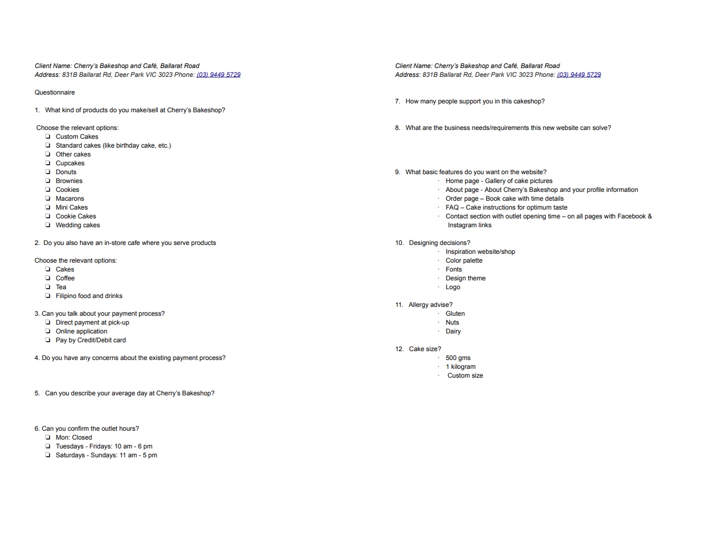

2. Moodboard

   (Moodboard screenshots) ??

3)  Sample wireframes - We

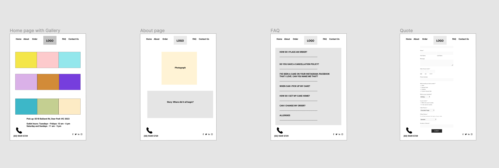

#### Post Meeting

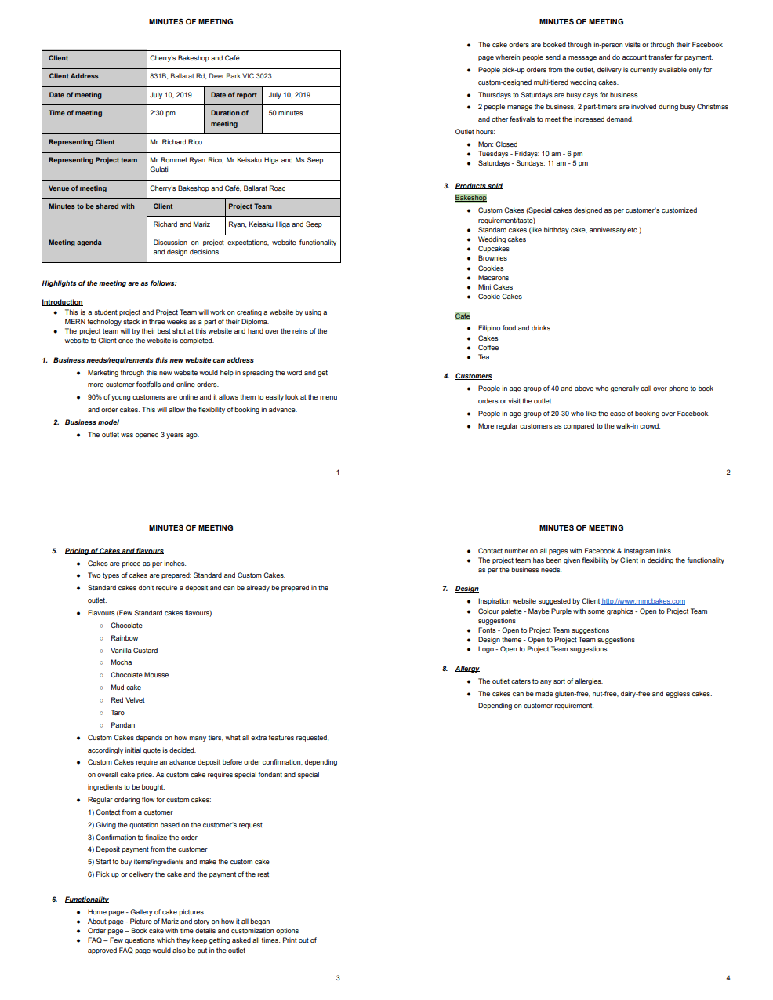

**Client Diary: https://docs.google.com/document/d/1GXz-Ycdg-1Z4bm33R-HGBCuojCI2e6UWefENzfR5Pio/edit?usp=sharing**

**Client testimonial 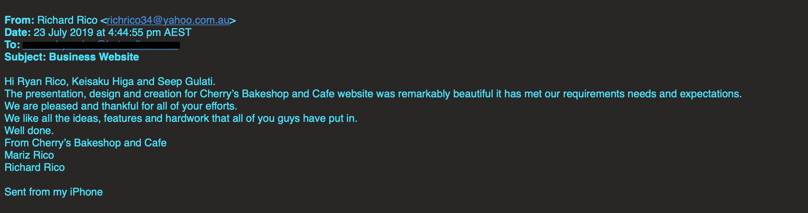**

## Design process

To balance bright red client logo, we have utilized a simple colour theme of purple with timeless white and black. 'Playball' font lends the cursive and artistic touch to the website.

Website Wireframes

## User stories

1.  As a User, I should be able to see the business phone number on every page when I navigate the website. So that I can call them if I need to make a booking or ask for a quote.
2.  As a User, I want to see a menu or gallery of cake pictures. So that I can decided what I want.
3.  As a User, I want to be able to easily navigate the website. So that I can quickly make an order.
4.  As a User, I want to have a detailed FAQ. So that my questions are answered before sending a quote.
5.  As a User, I want to place an order with special instructions. So that the shop can create a cake according to my requirements.
6.  As a User, I want to see the store's facebook and instagram links. So that I can look at cake inspirations.

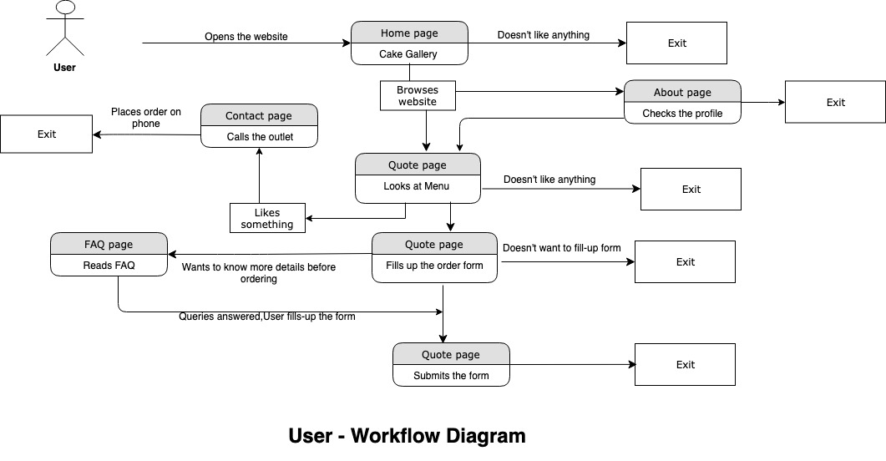

1. As Admin, I should be able to see a Dashboard of customers orders when I log into the website. So that I can easily process my orders.

2. As Admin, I should be able to look at customer order in detail and understand what are the special requirements of each customer. So that I can understand my customer needs properly and can address them.

3. As Admin, I should be able to get customer contact details. So that I can contact my customer when the order is ready.

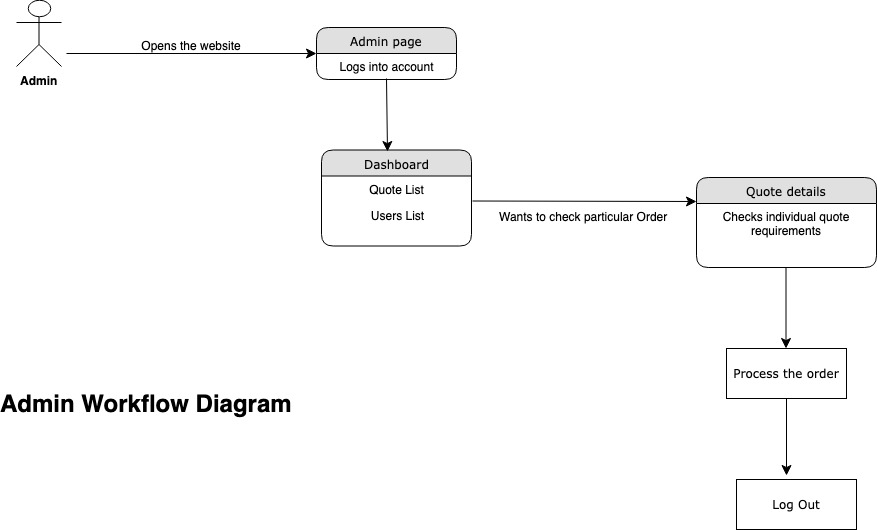

- Menu Design

  As client didn't have any existing menu and flavour list, we designed cake flavours and filipino food menu that can be downloaded on Quote page.

  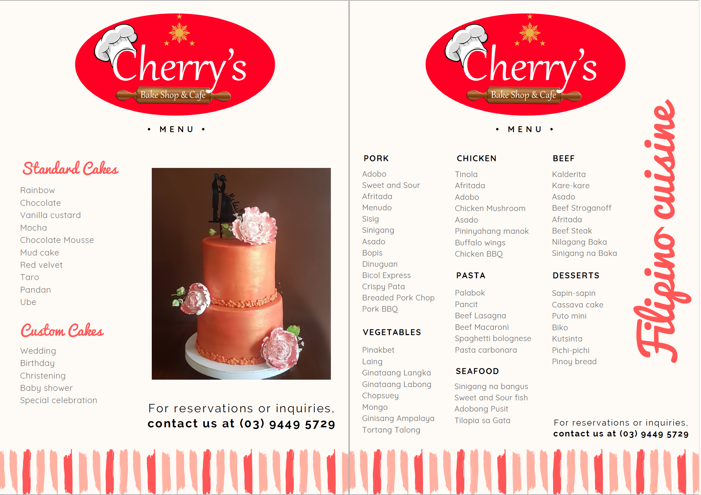

- Database Entity Relationship Diagrams
  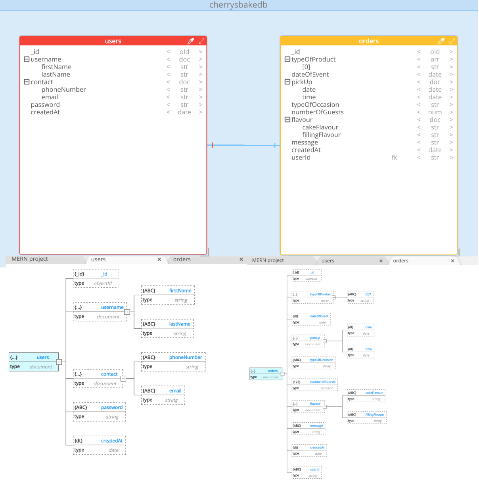

- Data Flow Diagram
  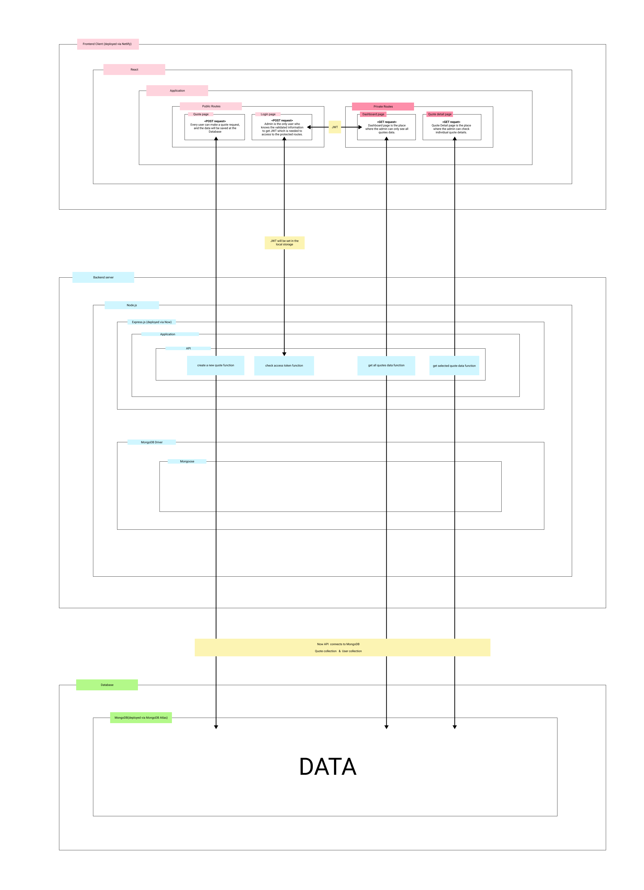

- OO design documentation
  
  This is a representation of the OO Design of our application which shows the methods of our data models.

## Tech stack

CherryBakeshop application is built using a simple REST API with NodeJS and Express. Persistence is provided by MongoDb Atlas as a cloud database.

PostMan has been used for testing. Jest has been used for Test suites. UI has been made in React.

## Instructions

Prerequisites

- The first thing you need to have is Node.js on your computer.You can download the Node.js installer from the Node.js website at: https://nodejs.org/en/download/

- Once Node.js is installed, open a terminal and enter the `node --version` on command line to verify that it is installed correctly. This application is using Node 10.16.0 version.?

Installation

1. You need to open the repository in a code editor.

2. cd into `backend folder` and run below command.
   `npm install`

3. To start the backend server, run below command.
   `npm start`

4. You will see the App listening on port 5000

5. To view UI in the browser. cd into `frontend folder` and run below command.
   `npm install`

6. To start the frontend react app, run below command.
   `npm start`

7. You can now view frontend in the browser on http://localhost:3000
   `npm start`

## Testing

1. To run tests, cd into `backend` and run below command.
   `npm test`

2. This will start the test suites and you will see total tests with coverage.

### Testing evidence

- Backend testing coverage: 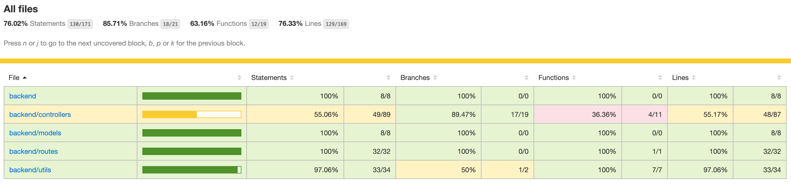

- Testing checklist: 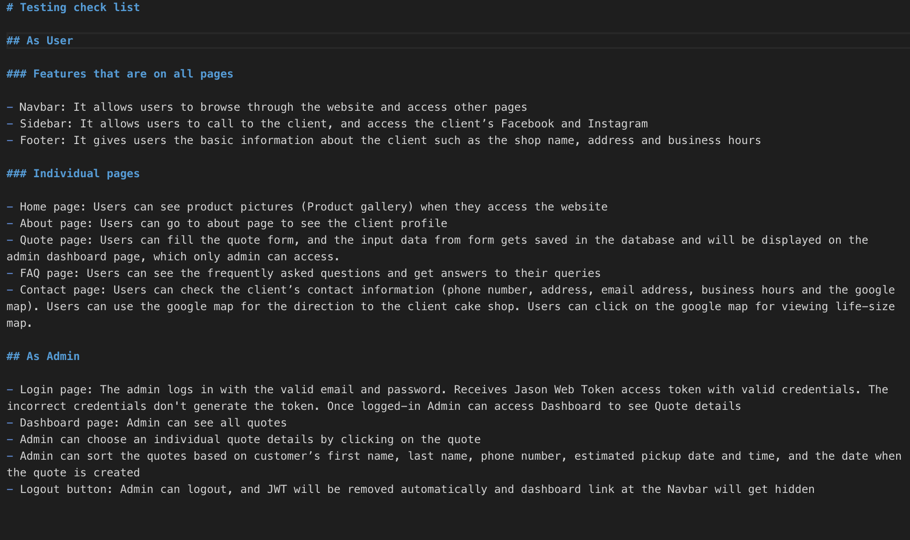

- Development Manual Testing: https://youtu.be/31PVBlN3Nhk

- Production Manual Testing: https://youtu.be/8K5ywoXLHNc

- Frontend coverage: We have done manual testing of all frontend elements. As, we started working on frontend testing, but didn't get around to fixing our tests. Here's a snapshot 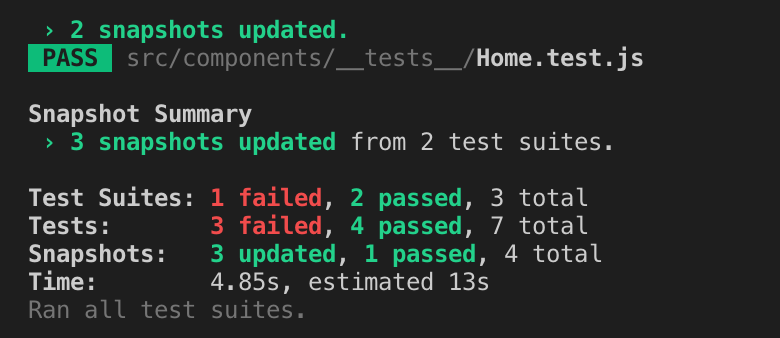

## Project Management

    * Timeline
    * Screenshots of Trello board(s)
    * GitHub - discuss the process of pull requests and screenshot
    * Team Communication screen shots

## Short Answer questions

- What are the most important aspects of quality software?

### Flexibility and Extensibility

The ability of software to remove, add and modify functionality with ease and without breaking it is important as change is a regular occurence in software development.

### Maintainability and Readability

Making sure your code has useful interface definitions, proper documentation and code documentation makes your software more maintainable, which includes the ability to change error corrections and minor functions.

### Performance and Efficiency

This has to do with the response time of the software. Response time should be at acceptable intervals and not increase depending on the amount of transactions. An optimal performance ratio must be the goal.

### Scalability

### Usability and Accessability

Simple and easy to use software is best practice as this means less time to complete a task for users. It should also support different accessibility types of control for people with a range of disabilities.

### Platform Capability and Portability

Quality software should be able to be run on many platforms. This is so more people can use it. Portability is the ability for software to be converted to run on other platforms.

### Testability and Manageability

Quality software needs quality testing. Source code should be tested with the most coverage and most efficient testing methods. Software should also be manageable after deployment. A proper

### Security

### Functionality and Correctness

- What libraries are being used in the app and why? 1. Express 2. React 3. Mongoose 4. Node 5. MongoDB 6. Jest 7. Mocha 8. Chai 9. Json Web Token 10.

* A team is about to engage in a project, developing a website for a small business.
  What knowledge and skills would they need in order to develop the project? 1. Business requirements 2. Design approach 3. RESTful API knowledge 4. Project management 5. UI development 6. Client documentation 7. User stories 8. Development skills 9. Version control 10. Project documentation (e.g. README.md) 11.

- Within your own project what knowledge or skills were required to complete your project, and overcome challenges? 1. Power of googling (problem solving skills) 2. Merging pull request after team review 3. Frequent team communication - in person(better) 4. Putting all requirement in Trello and discussing everyday 5.

- Evaluate how effective your knowledge and skills were this project, using examples, and suggest changes or improvements for future projects of a similar nature? 1.
