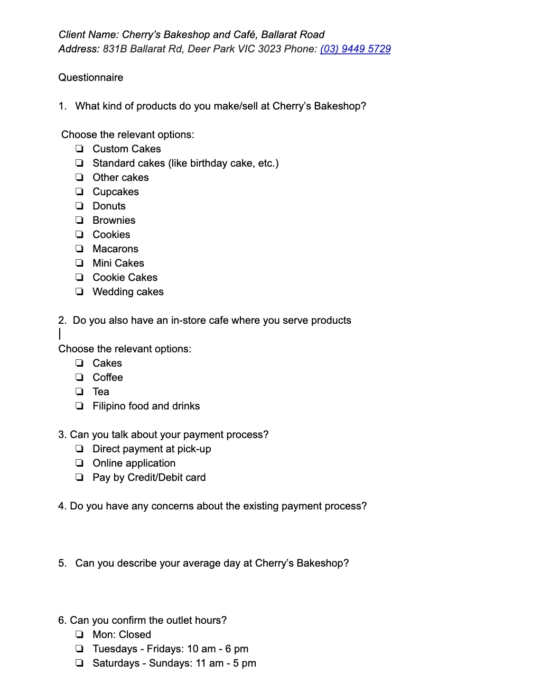
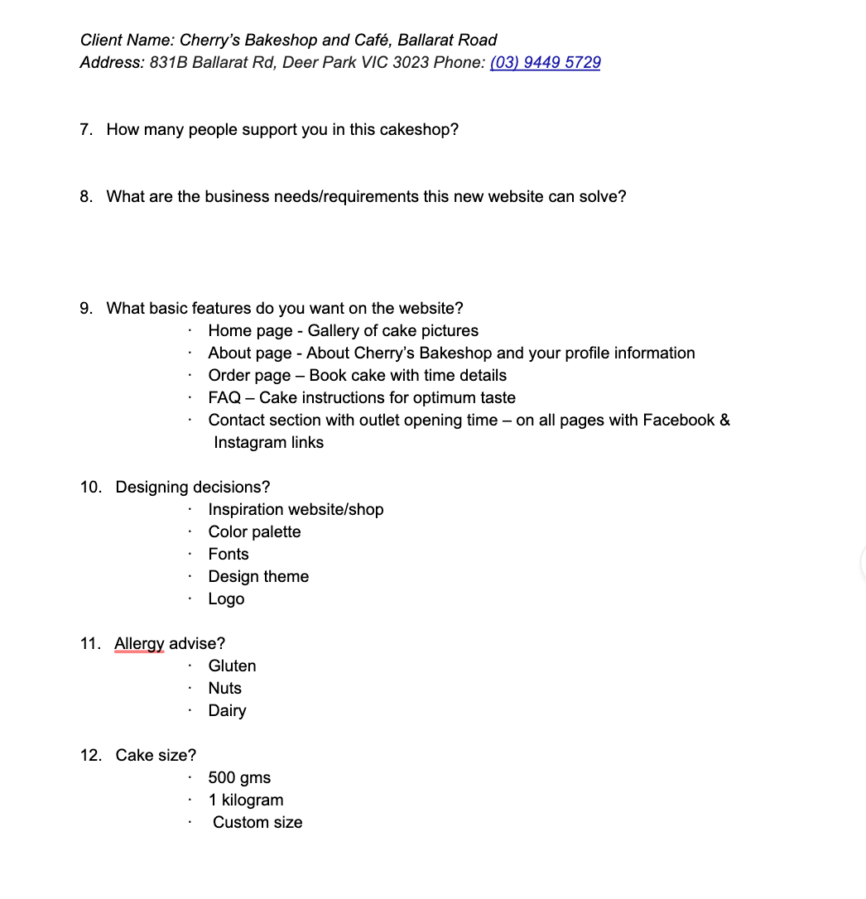
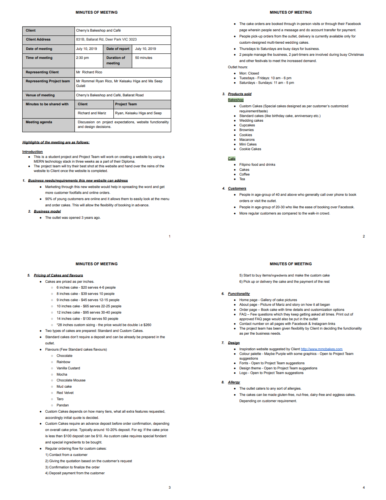
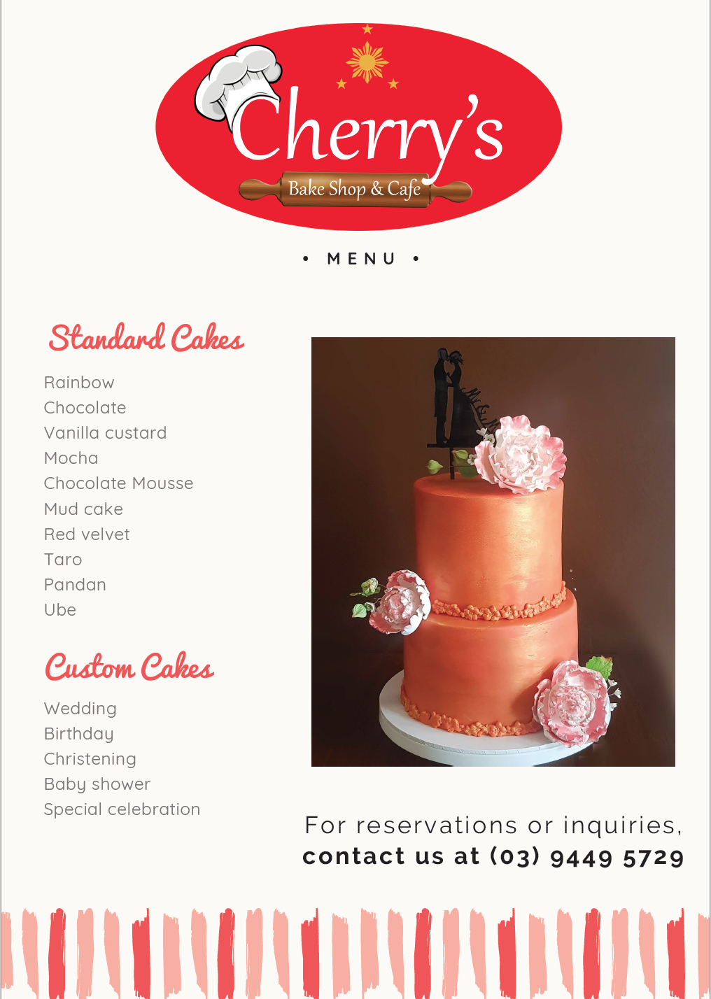
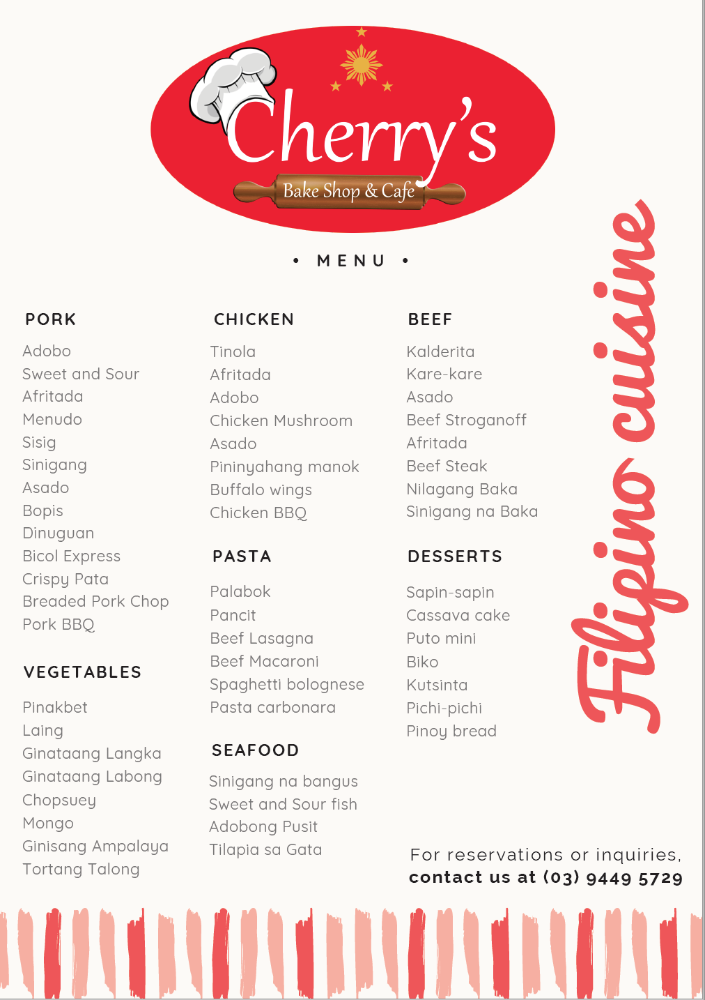

## About Cherry's Bakeshop and Cafe

Cherry's Bakeshop and Cafe's(CBC) application allows users to view cake and filipino food options and send their customized requirements by filling a quote form. This is a MERN stack group project utilizing: MongoDb (Mongoose ODM) Express, ReactJS and NodeJS.

## Website (gif)

## Deployment

    Client: https://cherrysbakeshopandcafe.netlify.com
    * Server details are listed in cherrys-bake-shop/frontend/.env.production

## Github Repository

    https://github.com/KeisakuHiga/cherrys-bake-shop

## Contributors

[KeisakuHiga](https://github.com/KeisakuHiga)
[SeepGulati](https://github.com/SeepG)
[RyanRico](https://github.com/rommelryanrico)

## Index

- [Description of application](#description-of-application)
- [Functionality](#functionality)
- [Client communication](#client-communication)
- [Design Process](#design-process)
- [User stories](#user-stories)
- [Tech Stack](#tech-stack)
- [Testing](#testing-evidence)
- [Testing Evidence](#
- [Tools & methodologies](#tools)
- [Short answer questions](#short-answer-questions)

## Description of application

/Problem definition/Business requirement

- 90% of young customers are online and the client wanted to cater to this market. They had created a facebook page, wherein they were taking orders. However, they also wanted to have a website to showcase their food options and handle frequently asked questions and have a more robust quote information gathering system.

This new website would help in spreading the word in the neighborhood and get more customer footfalls and offers online flexibility of sending customizations via Quote form to CBC(Client)in advance.

Solution

## Functionality

- Navbar: Allows users to browse through the website and access all pages
- Side bar: Allows users to call the client, and access social pages of CBC on Facebook & Instagram
- Footer: Allows User to see CBC shop address and business hours
- Home page: Landing page, allows users to see gallery of cake pictures and filipino food
- About page: Users can find about the story/profile of Cherry's Bakeshop and Cafe
- Quote page: Users can fill the quote form and book cake with time details and customization options.
- FAQ page: Users can see the frequently asked questions and get answers to their queries
- Contact page: Users can check the client’s contact information (phone number, address, email address, business hours and the Google map). Users can click on map for a bigger map view, it allows the user to get the directions to the shop.

* Admin login details are mentioned in cherrys-bake-shop/frontend/.env.production

- Login page: The admin logs in with the valid email and password. Receives Jason Web Token access token with valid credentials. The incorrect credentials don't generate the token. Once logged-in Admin can access Dashboard to see Quote details
- Dashboard page: Admin can see all quotes
- Admin can choose an individual quote details by clicking on the quote
- Admin can sort the quotes based on customer’s first name, last name, phone number, estimated pickup date and time, and the date when the quote is created
- Logout button: Admin can logout, and JWT will be removed automatically and dashboard link at the Navbar will get hidden

## Client communication

We pitched Cherry's Bakeshop & Cafe for becoming our client for our voluntary student project of 3 weeks. The client agreed to our proposal and suggested to have a look at their social media pages for content. We requested for a face-to-face team meeting at their shop to discuss business requirements and sign-off deliverables.

### Meeting Preparation phase

    1. Client Questionnaire - We prepared a questionnaire to understand the business requirements and client business model in detail and shared it with client before the meeting. This helped the client to go through the questions and he was more prepared to answer the questions.

    2. Agenda of the meeting

    3.  Moodboard

    4.  Sample wireframes

Client minutes: 
Client diary: https://docs.google.com/document/d/1GXz-Ycdg-1Z4bm33R-HGBCuojCI2e6UWefENzfR5Pio/edit?usp=sharing

- Client testimonial
  

## Design process

To balance bright red client logo, we have utilized a simple colour theme of purple with timeless white and black. 'Playball' font lends the cursive and artistic touch to the website.

Website Wireframes

## User stories

1.  As a User, I should be able to see the business phone number on every page when I navigate the website. So that I can call them if I need to make a booking or ask for a quote.
2.  As a User, I want to see a menu or gallery of cake pictures. So that I can decided what I want.
3.  As a User, I want to be able to easily navigate the website. So that I can quickly make an order.
4.  As a User, I want to have a detailed FAQ. So that my questions are answered before sending a quote.
5.  As a User, I want to place an order with special instructions. So that the shop can create a cake according to my requirements.
6.  As a User, I want to see the store's facebook and instagram links. So that I can look at cake inspirations.

1. As Admin, I should be able to see a Dashboard of customers orders when I log into the website. So that I can easily process my orders.

2. As Admin, I should be able to look at customer order in detail and understand what are the special requirements of each customer. So that I can understand my customer needs properly and can address them.

3. As Admin, I should be able to get customer contact details. So that I can contact my customer when the order is ready.

- Menu Design
  As client didn't have any existing menu and flavour list, we designed cake flavours and filipino food menu that can be downloaded on Quote page.

  
  

- Database Entity Relationship Diagrams

* Data Flow Diagram

* OO design documentation

## Tech stack

CherryBakeshop application is built using a simple REST API with NodeJS and Express. Persistence is provided by MongoDb Atlas as a cloud database.

PostMan has been used for testing. Jest has been used for Test suites. UI has been made in React.

## Instructions

Prerequisites

- The first thing you need to have is Node.js on your computer.You can download the Node.js installer from the Node.js website at: https://nodejs.org/en/download/

- Once Node.js is installed, open a terminal and enter the `node --version` on command line to verify that it is installed correctly. This application is using Node 10.16.0 version.?

Installation

1. You need to open the repository in a code editor.

2. cd into `backend folder` and run below command.
   `npm install`

3. To start the backend server, run below command.
   `npm start`

4. You will see the App listening on port 5000

5. To view UI in the browser. cd into `frontend folder` and run below command.
   `npm install`

6. To start the frontend react app, run below command.
   `npm start`

7. You can now view frontend in the browser on http://localhost:3000
   `npm start`

## Testing

1. To run tests, cd into `backend` and run below command.
   `npm test`

2. This will start the test suites and you will see total tests with coverage.

### Testing evidence

- Backend testing coverage: 

- Testing checklist: 

- Development Manual Testing: https://youtu.be/31PVBlN3Nhk

- Production Manual Testing: https://youtu.be/8K5ywoXLHNc

- Frontend coverage: We have done manual testing of all frontend elements. As, we started working on frontend testing, but didn't get around to fixing our tests. Here's a snapshot 

## Project timeline

## Tools

    * Screenshots of Trello board(s)
    * GitHub - discuss the process of pull requests and screenshot
    * Team Communication screen shots

## Short Answer questions

### Q1. What are the most important aspects of quality software?
1. No bugs 
2. Easy to use 
3. Easy to maintain 
4. Scaleability 
5. Readable code 
6. Includes well comments 

### Q2. What libraries are being used in the app and why? 
#### Frontend
##### dependencies
    "@fortawesome/fontawesome-svg-core": "^1.2.19",
    "@fortawesome/free-brands-svg-icons": "^5.9.0",
    "@fortawesome/free-solid-svg-icons": "^5.9.0",
    "@fortawesome/react-fontawesome": "^0.1.4",
    "axios": "^0.19.0",
    "bootstrap": "^4.3.1",
    "dotenv": "^8.0.0",
    "history": "^4.9.0",
    "jquery": "^3.4.1",
    "lodash": "^4.17.14",
    "moment-timezone": "^0.5.26",
    "netlify-cli": "^2.11.24",
    "popper.js": "^1.15.0",
    "react": "^16.8.6",
    "react-bootstrap": "^1.0.0-beta.9",
    "react-component-props-table": "0.0.1",
    "react-dom": "^16.8.6",
    "react-moment": "^0.9.2",
    "react-phone-number-input": "^2.3.20",
    "react-router-dom": "^5.0.1",
    "react-scripts": "3.0.1"
    
##### devDependencies
    "@fortawesome/fontawesome-free": "^5.9.0",
    "chai": "^4.2.0",
    "enzyme": "^3.10.0",
    "enzyme-adapter-react-16": "^1.14.0",
    "enzyme-to-json": "^3.3.5",
    "react-test-renderer": "^16.8.6",
    "sinon": "^7.3.2",
    "sinon-chai": "^3.3.0"

#### Backend
##### dependencies
    "@hapi/joi": "^15.1.0",
    "bcrypt": "^3.0.6",
    "cors": "^2.8.5",
    "dotenv": "^8.0.0",
    "engines": "^0.4.0",
    "express": "^4.17.1",
    "faker": "^4.1.0",
    "jsonwebtoken": "^8.5.1",
    "moment-timezone": "^0.5.26",
    "mongoose": "^5.6.3",
    "nodemon": "^1.19.1",
    "shortid": "^2.2.14"

##### devDependencies
    "jest": "^24.8.0",
    "now": "^15.7.0",
    "supertest": "^4.0.2"

### Q3. A team is about to engage in a project, developing a website for a small business. What knowledge and skills would they need in order to develop the project? 
  - **Understanding about a client's business needs and requirements**: is necessary because developing a project should be the thing to solve client's business issues. Developer team should be a problem-solving team to create the application that gives the solution for the client, not be a group that just makes an application.
  - **Well communication with the client during the project**: is must skill. Developers have communication many times with their client to confirm whether or not the project is what the client is expecting during the project. This skill allows you to reflect the client's real needs to the project.

  - **Project management skill**: is important for managing the team project. You have to control the each task progress properly over the project as they will be allocated to each team member and it would be hard to integrate all works into one product unless you have this skill.

  - Design approach
  - RESTful API knowledge
  - UI development 
  - Client documentation 
  - User stories 
  - Development skills 
  - Version control 
  - Project documentation (e.g. README.md) 
  

### Q4. Within your own project what knowledge or skills were required to complete your project, and overcome challenges?

#### Hard skills
* *Vanilla Javascript*: understanding functional programming principles, asynchronous code, and callbacks.
* *Document Databases (MongoDB/Mongoose)*: converting a relational databse structure into document database.
* *Express API/Server*: creating and using middleware to manage requests and respsonses to public and protected routes.
* *React.js*: working with multiple layers of components and create-react-app folder structure.
* *Node.js*: using Node.js to run multiple localhost ports on one computer.
* *NPM and NPM libraries*: researching and applying NPM packages and libraries to our application.
* *Testing(Frontend: Mocha, Chai, Enzyme, Backend: Jest, Supertest)*: required to test our application code.
* *GitHub/GitHub*: each of us were required to create branchs, push to master, peer to peer code review and merging or resolving conflicts in GitHub.
* *HTML5*: compiling semantic HTML in React components logic.
* *CSS3*: using Sass compilers to create mixins and global variables to refactor code.
* *Figma*: used as a design tool for wireframes and assets.
* *Trello*: breakdown of tasks following Agile methodologies.
* *Distributed Deployment*: client, server and database deployed to Netlify, Now, MongoDB Atlas respectively.

#### Soft skills
* Team collaboration
* Good communication skills
* Project management
* Research and development skills

### Q5. Evaluate how effective your knowledge and skills were this project, using examples, and suggest changes or improvements for future projects of a similar nature? 

1. 
